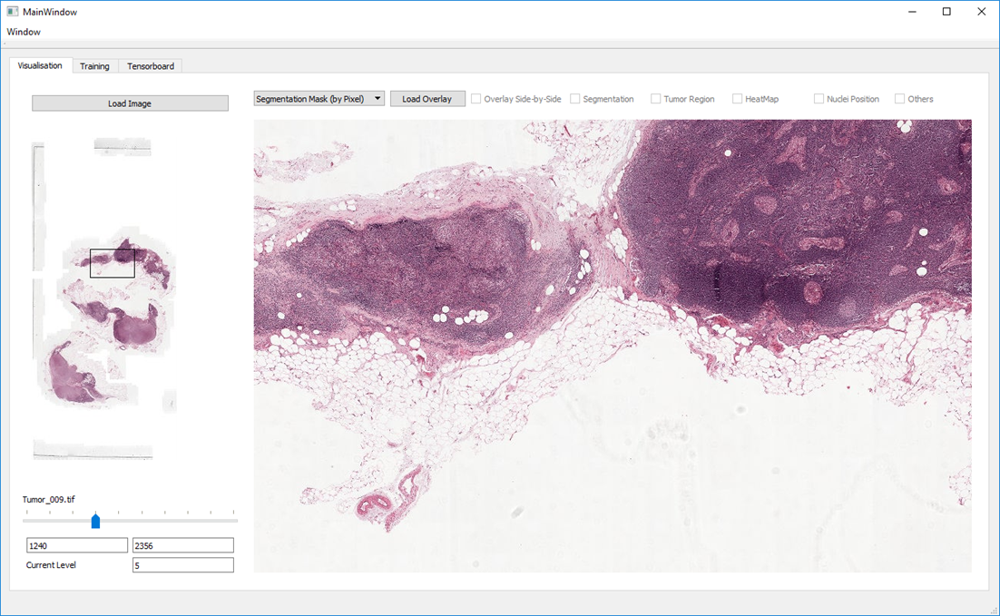
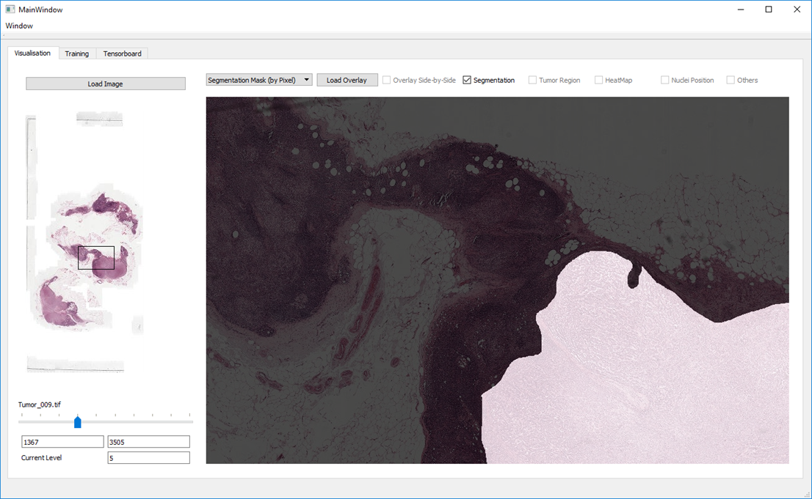
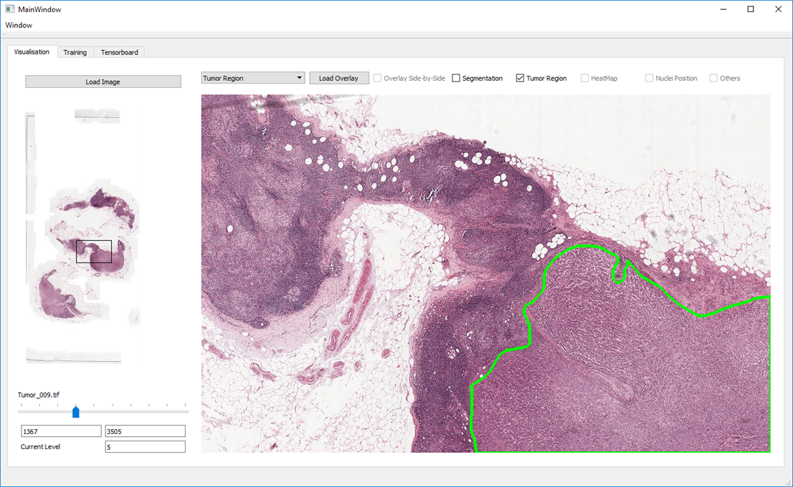
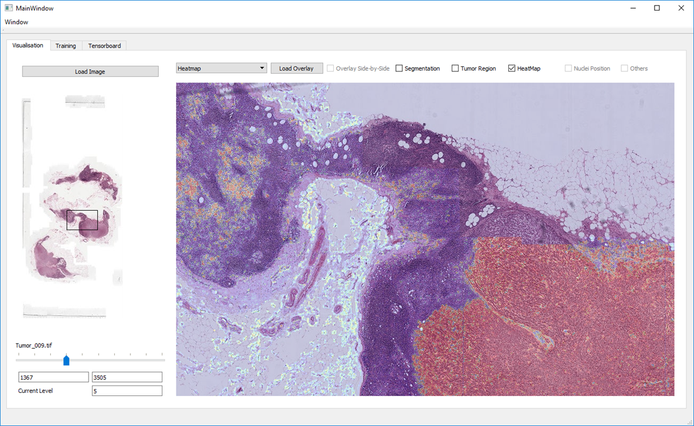
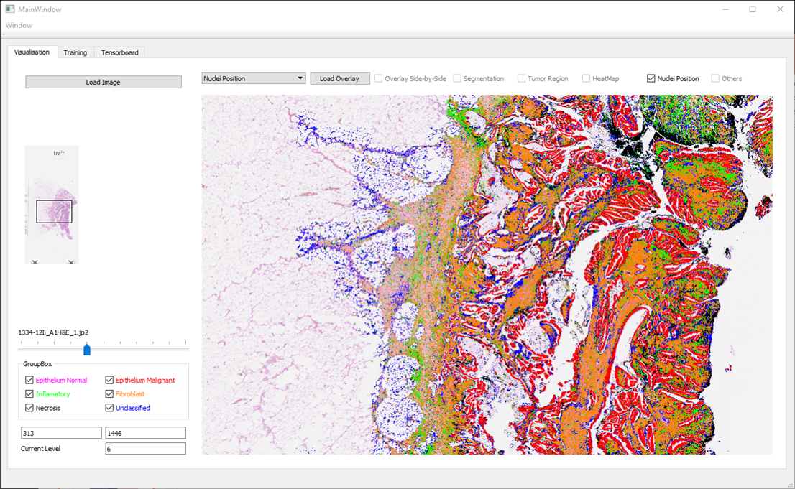
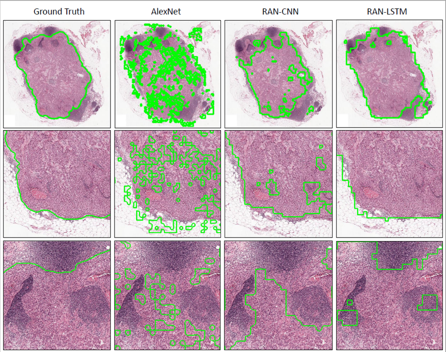

Use this software for your next deep learning project with histopathological images.

If you want to:
- [x] Load WSIs of different formats (ndpi, tiff, jp2..)
- [x] Pan, zoom, view at different resolutions
- [x] Overlay either segmentation masks, nuclei positions, tumor regions, heatmaps, etc
- [x] Train your own deep learning network
- [x] Test, and then visualise your trained network
- [x] Visualise the training process
- [x] Go through sample scripts for dealing with WSIs

then this software is for you.

This repository also contains the implementation for [Representation-Aggregation Networks for Segmentation of Multi-Gigapixel Histology Images](https://arxiv.org/abs/1707.08814), published at Workshop on Deep Learning in Irregular Domains (DLID) in BMVC2017.

Refer to [this presentation](Abhinav_Summer_Internship_Summary.pptx) for a quick walkthrough.

For any queries, contact me or create an issue.

## Installation Instructions
Install all packages mentioned in requirements.txt.
If you plan to use JP2 images, enable MATLAB Engine for Python.

## Sample Visualisation
<table>
  <tr>
    <td>Visualisation Pane</td>
    <td>Segmentation Mask</td>
  </tr>
  <tr>
    <td></td>
    <td></td>
  </tr>
  <tr>
    <td>Tumor Region</td>
    <td>Heatmap</td>
  </tr>
  <tr>
    <td></td>
    <td></td>
  </tr>
  <tr>
    <td>Nuclei Position</td>
  </tr>
  <tr>
    <td></td>
  </tr>
</table>

## RAN-LSTM Results

